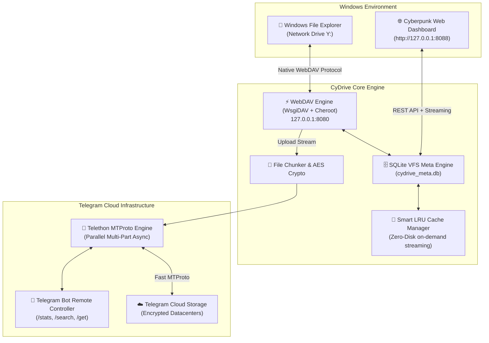

---
AIGC:
  ContentProducer: '001191110102MAD55U9H0F10002'
  ContentPropagator: '001191110102MAD55U9H0F10002'
  Label: '1'
  ProduceID: '697f3025-42c6-4453-aec5-772a94c7a030'
  PropagateID: '697f3025-42c6-4453-aec5-772a94c7a030'
  ReservedCode1: 'e7c11ee3-1389-47ce-b981-13458f686347'
  ReservedCode2: 'e7c11ee3-1389-47ce-b981-13458f686347'
---

# 🚀 سای‌درایو (CyDrive) — Fork with Improvements

> **Forked from [thecynetx/CyDrive](https://github.com/thecynetx/CyDrive).**  
> This repository contains personal improvements on top of the original Cynet Security Team work, focusing on SOCKS5 proxy support, WebDAV port flexibility, rename/delete synchronization, upload status reliability, and Web UI fixes.  
> 本仓库是在 [thecynetx/CyDrive](https://github.com/thecynetx/CyDrive) 基础上的个人改进版，主要增加了 SOCKS5 代理、WebDAV 端口可调、重命名/删除同步、上传状态修复和 Web 面板优化。

<div align="center">


### **تبدیل تلگرام به هارد دیسک ابری نامحدود و درایو بومی ویندوز**
*توسعه‌داده‌شده توسط تیم امنیت سایبری ساینت (**[Cynet Security Team](https://cynetx.ir)**)*

[](https://github.com/thecynetx/CyDrive)
[](https://python.org)
[](https://telegram.org)
[](https://en.wikipedia.org/wiki/WebDAV)
[-00f3ff?style=for-the-badge)](http://127.0.0.1:8088)
[](LICENSE)

[🌐 English Documentation](README_EN.md) • [چرا CyDrive؟](#-چرا-cydrive) • [قابلیت‌های کلیدی](#-امکانات-و-قابلیت‌های-برجسته) • [آموزش راه‌اندازی](#-آموزش-گام‌به‌گام-۰-تا-۱۰۰-راه‌اندازی) • [داشبورد وب](#-داشبورد-تحت-وب-سایبرپانکی) • [دستورات ترمینال](#-رابط-خط-فرمان-و-ابزارهای-cli) • [سوالات متداول](#-سوالات-متداول-و-عیب‌یابی-faqs)

</div>

---

## 💡 چرا CyDrive؟

بیایید واقع‌بین باشیم: **اشتراک‌های سرویس‌های ابری خارجی (مثل گوگل‌درایو، دراپ‌باکس و وان‌درایو) بسیار گران هستند و حجم‌های رایگان آن‌ها به شکلی خنده‌دار کم است!**  
گوگل‌درایو فقط ۱۵ گیگابایت فضای اشتراکی با جیمیل می‌دهد، دراپ‌باکس فقط ۲ گیگابایت حجم دارد و برای پلن‌های چند ترابایتی باید ماهانه هزینه‌های سنگین دلاری پرداخت کنید.

در سوی دیگر، **سرورهای قدرتمند تلگرام، فضای ابری نامحدود، پرسرعت، رایگان و فوق‌العاده پایداری را در اختیار کاربران قرار داده‌اند.**  
اما استفاده سنتی از تلگرام به عنوان درایو ابری همیشه یک چالش خسته‌کننده بود:
- ریختن فایل‌ها در «پیام‌های ذخیره‌شده (Saved Messages)» چت شما را به یک انبار بی‌نظم، شلوغ و غیرقابل‌جستجو تبدیل می‌کرد.
- هیچ ساختار پوشه‌بندی درختی (Folder / Subfolder) در تلگرام وجود نداشت.
- برای هر بار استفاده یا مشاهده فایل‌ها، باید برنامه تلگرام را باز کرده و فایل‌ها را به صورت دستی دانلود و در ویندوز ذخیره می‌کردید.

**پروژه CyDrive این معضل را یک‌بار برای همیشه حل کرده است.** این نرم‌افزار، چت تلگرام شما را مستقیماً به یک **درایو هارد دیسک واقعی در ویندوز (مانند درایو `Y:`)** تبدیل می‌کند!

فقط کافیست یک پوشه حجیم را با موس بکشید و داخل درایو `Y:` ویندوز رها کنید؛ CyDrive ساختار پوشه‌ها را در دیتابیس هوشمند SQLite ثبت کرده و فایل‌ها را با پروتکل پرسرعت MTProto در تلگرام آپلود می‌کند. همچنین اگر بیرون از منزل باشید و با گوشی عکسی را به ربات تلگرام خود بفرستید، به محض بازگشت به خانه، آن عکس بدون نیاز به هیچ کابل یا نرم‌افزار جانبی داخل درایو `Y:` کامپیوترتان آماده استفاده است — **همه‌چیز بدون اشغال حتی ۱ بایت از فضای هارد دیسک فیزیکی سیستم شما!**

---

## ⚡ مقایسه جامع: چرا CyDrive بی‌رقیب است؟

| قابلیت | 📁 CyDrive (نسخه ۲) | 📦 Google Drive / Dropbox | 💬 تلگرام ساده (Saved Messages) |
|---|---|---|---|
| **ظرفیت ذخیره‌سازی** | **نامحدود و رایگان (Unlimited)** | ۲ تا ۱۵ گیگابایت (رایگان) | نامحدود و رایگان |
| **ادغام در This PC ویندوز** | **درایو اختصاصی مستقل (`Y:`)** | نیازمند نرم‌افزارهای سنگین سینک | ❌ ندارد (فقط درون چت تلگرام) |
| **استریم ابری بدون پر شدن هارد** | ✅ استریم زنده (Zero-Disk Bloat) | ⚠️ نیازمند پلن‌های پولی (Smart Sync) | ❌ باید کل فایل دانلود شود |
| **حداکثر حجم هر فایل** | **۲ گیگابایت (یا نامحدود با Chunking)** | ۱۵ گیگابایت (رایگان) / ۵ ترابایت | ۲ گیگابایت (۴ گیگ در پریمیوم) |
| **پوشه‌بندی درختی و تودرتو** | ✅ دیتابیس سلسله‌مراتبی SQLite | ✅ دارد | ❌ ندارد (جریان چت خطی) |
| **نیاز به درایورهای سنگین کرنل** | ❌ **خیر (WebDAV بومی ویندوز)** | ⚠️ بله (درایورهای مجازی فایل‌سیستم) | ❌ خیر |
| **پنل وب اختصاصی با پلیر مدیا** | ✅ داشبورد سایبرپانکی مدرن (`:8088`) | ✅ پنل وب استاندارد | ⚠️ فقط پلیر داخلی تلگرام |
| **رمزنگاری سمت کاربر (Zero-Knowledge)** | ✅ اختیاری با الگوریتم AES-256-GCM | ❌ رمزنگاری اختصاصی سمت سرور | ⚠️ پروتکل MTProto سرور |

---

## ✨ امکانات و قابلیت‌های برجسته

- 🔄 **همگام‌سازی دوطرفه بلادرنگ (Two-Way Sync):**  
  فایل یا پوشه‌ای را داخل درایو `Y:` ویندوز کپی کنید؛ بلافاصله در پس‌زمینه به تلگرام آپلود می‌شود. اگر فایلی را در تلگرام برای ربات بفرستید، بلافاصله در درایو `Y:` و پنل وب ظاهر می‌شود.
- 📁 **درایو مجازی بومی ویندوز (`Y:`):**  
  در کنار درایوهای `C:` و `D:` در پنجره **This PC** ویندوز اکسپلورر دیده می‌شود. هنگام اجرای برنامه خودکار متصل (Mount) و هنگام خروج بدون دردسر جدا (Unmount) می‌شود.
- 🌐 **داشبورد تحت وب سایبرپانکی (`http://127.0.0.1:8088`):**  
  رابط کاربری مدرن با تم تاریک، انیمیشن‌های شیشه‌ای (Glassmorphism)، عقربه حجم مصرفی و آمار لحظه‌ای.  
  **پخش آنلاین مدیا:** تماشای فیلم‌های MP4، گوش دادن به موزیک‌های FLAC/MP3 و نمایش عکس‌ها داخل مرورگر بدون نیاز به دانلود کل فایل!
- 🗄️ **موتور فراداده فوق‌سریع SQLite WAL:**  
  ثبت ساختار درختی پوشه‌ها، هش SHA-256 فایل‌ها و شناسه‌های پیام در تلگرام. جستجو و فیلتر میان صدها هزار فایل در کسری از میلی‌ثانیه.
- 👁️ **مانیتورینگ رویدادهای فایل‌سیستم با `watchdog`:**  
  مصرف نزدیک به صفر پردازنده (بدون استفاده از حلقه‌های سنگین `os.walk`). مجهز به الگوریتم بررسی پایداری و باز بودن فایل (`is_file_ready`) برای جلوگیری از آپلود فایل‌های ناقص حین کپی.
- 🧩 **تقسیم خودکار فایل‌های بسیار حجیم (Chunking بالای ۲ گیگابایت):**  
  امکان آپلود و نگهداری فایل‌های سنگین (۵، ۲۰ یا ۵۰ گیگابایت) با تقسیم خودکار به پارت‌های استاندارد و اسمبل نامرئی هنگام دانلود.
- 🤖 **ربات هوشمند کنترل از راه دور:**  
  - دستور `/stats` برای گزارش حجم کل ابری و تعداد فایل‌های ذخیره‌شده.  
  - دستور `/search <نام_فایل>` برای جستجوی سریع در دیتابیس درایو.  
  - دستور `/get <نام_فایل>` برای دانلود مستقیم هر فایلی از روی گوشی.
- 🔐 **رمزنگاری امن سمت کلاینت (اختیاری):**  
  رمزنگاری فوق‌العاده امن سرتاسری با استاندارد نظامی AES-256-GCM؛ فایل‌ها پیش از خروج از کامپیوتر رمزگذاری می‌شوند و حتی تلگرام هم محتوای آن‌ها را نمی‌بیند.

---

## 🏗️ معماری و سازوکار درونی سیستم



---

## 🚀 آموزش گام‌به‌گام ۰ تا ۱۰۰ راه‌اندازی

برای راه‌اندازی CyDrive فقط به ۵ دقیقه زمان نیاز دارید. مراحل زیر را به ترتیب دنبال کنید:

### گام ۱: ساخت ربات و دریافت توکن تلگرام (کمتر از ۱ دقیقه)
1. برنامه تلگرام را باز کنید و وارد ربات رسمی **[@BotFather](https://t.me/BotFather)** شوید.
2. دکمه **Start** را بزنید و سپس دستور `/newbot` را ارسال کنید.
3. یک **نام نمایشی** برای ربات خود بنویسید (مثلاً: `My Personal Drive`).
4. یک **یوزرنیم یکتا** که آخر آن عبارت `bot` داشته باشد انتخاب کنید (مثلاً: `MyCloud_Fast_bot`).
5. ربات BotFather یک توکن با ساختار زیر به شما تحویل می‌دهد:

```text
7123456789:ABCdefGhIJKlmNoPQRstuVWXyz_123456
```

این توکن را کپی کنید و در جایی نگه دارید.

### گام ۲: دریافت شناسه کاربری (Chat ID)
1. در تلگرام وارد ربات **[@userinfobot](https://t.me/userinfobot)** شوید و دکمه **Start** را بزنید.
2. این ربات یک پیام حاوی شناسه عددی اکانت شما (مانند `123456789`) ارسال می‌کند. این عدد، همان **Chat ID** شماست.
3. در نهایت، وارد چت ربات جدیدی که در گام اول ساختید شوید و روی دکمه **Start** کلیک کنید تا ربات اجازه ارسال پیام به شما را داشته باشد.

### گام ۳: دانلود پروژه و نصب پکیج‌ها

**🪟 در ویندوز (Windows PowerShell / CMD):**

```bash
git clone https://github.com/thecynetx/CyDrive.git
cd CyDrive
pip install -r requirements.txt
python main.py
```

**🐧 در سرورهای لینوکس (Ubuntu 22+/24+, Debian 12+, CentOS VPS):**

```bash
# نصب پیش‌نیازها
sudo apt update && sudo apt install -y python3 python3-pip python3-venv git

# کلون و ورود به پوشه
git clone https://github.com/thecynetx/CyDrive.git
cd CyDrive

# روش اول (پیشنهادی و بدون تداخل با پکیج‌های دبیان):
python3 -m venv venv
source venv/bin/activate
pip install -r requirements.txt
python3 main.py

# روش دوم (نصب مستقیم روی کل سرور بدون محیط مجازی):
pip install -r requirements.txt --break-system-packages --ignore-installed
python3 main.py
```

### گام ۴: اجرای جادویی CyDrive

* **در اولین اجرا چه رخ می‌دهد؟**
  1. بنر شیک و ترمینال رنگی ساینت بالا می‌آید.
  2. برنامه از شما **Bot Token** و سپس **Chat ID** را می‌پرسد.
  3. در ویندوز حرف درایو (پیش‌فرض `Y:`) و در لینوکس دسترسی عمومی وب‌پنل برای VPS سوال می‌شود.
  4. برنامه به طور خودکار تنظیمات را ذخیره کرده، درایو ابری را متصل نموده و تمام سرویس‌ها را اجرا می‌کند!

---

## 🐧 ۳ روش استفاده از CyDrive در سرورهای لینوکس (VPS / Ubuntu / Debian / CentOS)

در لینوکس بر خلاف ویندوز مفهوم «حرف درایو» وجود ندارد؛ بلکه درایو ابری ساینت به ۳ روش فوق‌العاده کاربردی در اختیارتان قرار می‌گیرد:

### ۱. دسترسی از طریق داشبورد وب سایبرپانکی (ساده‌ترین روش برای VPS):
روی هر دستگاهی (کامپیوتر یا موبایل) مرورگر خود را باز کرده و نشانی زیر را وارد کنید:  
👉 **`http://YOUR_SERVER_IP:8088`**
* **آپلود آسان:** فایل‌ها را مستقیماً با ماوس به داخل مرورگر بکشید و رها کنید تا در تلگرام ذخیره شوند.
* **پلیر آنلاین مدیا:** ویدیوها (MP4/MKV) و آهنگ‌ها (MP3/FLAC) را بدون نیاز به دانلود، مستقیماً از روی تلگرام تماشا کنید یا بشنوید.
* **جستجوی بلادرنگ:** هر فایلی را بر اساس نام در کسری از ثانیه پیدا کرده و با یک کلیک دانلود کنید.

### ۲. ماونت به عنوان یک پوشه ابری محلی در لینوکس (`~/CyDrive`):
با نصب پکیج `davfs2`، یک پوشه اختصاصی متصل به کلود در مسیر `~/CyDrive` در اختیارتان قرار می‌گیرد:

```bash
# نصب ماونتر WebDAV در لینوکس
sudo apt install -y davfs2

# اجرای CyDrive (پوشه ~/CyDrive خودکار ماونت می‌شود)
python3 main.py
```

اکنون تمامی دستورات لینوکس مستقیماً روی تلگرام اعمال می‌شوند:

```bash
# کپی یک فایل حجیم به کلود تلگرام
cp /var/backups/database.tar.gz ~/CyDrive/

# مشاهده لیست فایل‌های موجود در فضای ابری
ls -la ~/CyDrive/
```

### ۳. اتصال به Rclone و اسکریپت‌های خودکارسازی بکاپ سرور:
سرور استاندارد WebDAV روی پورت `8080` فعال است. می‌توانید با ابزار قدرتمند **Rclone** آن را به عنوان یک ریموت کلود بی‌نهایت تعریف کنید:

```bash
# دستور تنظیم rclone
rclone config
# نوع: webdav | آدرس: http://127.0.0.1:8080 | vendor: other

# سینک خودکار دایرکتوری سایت یا دیتابیس به تلگرام:
rclone sync /var/www/html/ cydrive:/MySiteBackup/ -P
```

---

## 🌐 داشبورد تحت وب سایبرپانکی

پس از اجرای برنامه، مرورگر خود را باز کرده و وارد نشانی زیر شوید:  
👉 **`http://127.0.0.1:8088`** (یا `http://YOUR_SERVER_IP:8088` روی سرور VPS)

<div align="center">


</div>

---

## 💻 رابط خط فرمان و ابزارهای CLI

<div align="center">


</div>

پروژه CyDrive دارای یک ابزار مدیریت جامع خط فرمان است:

| دستور | توضیح عملکرد |
|---|---|
| `python main.py run` | اجرای کامل تمام سرویس‌ها (WebDAV، تلگرام، پنل وب و ماونت خودکار درایو) |
| `python main.py mount` | اتصال و ماونت درایو شبکه ویندوز (مانند درایو `Y:`) |
| `python main.py unmount` | قطع اتصال و حذف ایمن درایو شبکه از ویندوز اکسپلورر |
| `python main.py fix-reg` | بهینه‌سازی خودکار رجیستری ویندوز برای حذف محدودیت ۵۰ مگابایتی WebDAV (تا ۴ گیگابایت) |
| `python main.py stats` | نمایش سریع آمار حجم ابری، تعداد فایل‌ها و وضعیت دیتابیس در ترمینال |
| `python main.py setup` | اجرای مجدد ویزارد تعاملی دریافت و ویرایش توکن و تنظیمات |

---

## 🔍 شفاف‌سازی ۱۰۰٪ صادقانه: چرا ویندوز مشخصات هارد من را نشان می‌دهد؟

بسیاری از کاربران هنگام ماونت درایو شبکه در ویندوز اکسپلورر سوال می‌پرسند:  
> *«چرا درایو `Y:` ظرفیت هارد اصلی من (مثلاً `Total size: 952 GB, Free: 263 GB`) را نشان می‌دهد؟ آیا هارد من اشغال می‌شود؟»*

### 💡 پاسخ مهندسی و فنی (تضمین ۰ بایت اشغال دیسک):

1. **علت رفتار ویندوز اکسپلورر:**  
   درایوهای شبکه محلی (`127.0.0.1`) در ویندوز توسط سرویس پیش‌فرض `WebClient` ویندوز هدایت می‌شوند. در سیستم‌عامل ویندوز، نوار گرافیکی درایوهای شبکه محلی به عنوان یک رفتار پیش‌فرض ویندوز، نشانگر بصری را بر اساس ظرفیت درایو میزبان (`C:`) رندر می‌کند.
2. **فایل‌ها در واقعیت کجا ذخیره می‌شوند؟**  
   **۱۰۰٪ روی سرورهای ابری تلگرام.** در کامپیوتر شما، فایل فقط برای چند ثانیه هنگام انتقال به عنوان بافر موقت قرار می‌گیرد و به محض اتمام آپلود به تلگرام، **به صورت خودکار و بلافاصله از روی هارد پاک (Delete) می‌شود.**
3. **آزمایش اثبات برای اطمینان شما:**
   - حجم خالی درایو `C:` خود را یادداشت کنید (مثلاً `۲۶۳.۱ گیگابایت`).
   - یک فایل حجیم (مثلاً ۵۰۰ مگابایت یا ۱ گیگابایت فیلم) را داخل درایو `Y:` کپی کنید.
   - پس از مشاهده پیام `✅ [CLOUD UPLOAD] Successfully uploaded`، حجم درایو `C:` را دوباره چک کنید.
   - خواهید دید که **حجم درایو C شما دقیقاً همان ۲۶۳.۱ گیگابایت مانده است** و پوشه پروژه دقیقاً **۰ بایت** است!

---

## 🧪 تست‌های خودکار و اعتبارسنجی کیفیت (Testing)

پروژه CyDrive دارای یک سوییت کامل از تست‌های خودکار است که سلامت تمام ماژول‌ها را ارزیابی می‌کند:

```bash
# اجرای تمامی تست‌های یکپارچه‌سازی و اعتبارسنجی
python -m unittest discover tests
```

---

## ❓ سوالات متداول و عیب‌یابی (FAQs)

<details>
<summary><strong>س: هنگام انتقال فایل‌های بالای ۵۰ مگابایت در ویندوز، ارور «File size exceeds the limit allowed» می‌گیرم. راه‌حل چیست؟</strong></summary>

کلاینت WebDAV پیش‌فرض ویندوز به صورت کارخانه‌ای انتقال تک‌فایل‌ها را به ۵۰ مگابایت محدود کرده است.  
برای حذف کامل این محدودیت، کافیست فقط یک‌بار دستور زیر را در ترمینال اجرا کنید:

```bash
python main.py fix-reg
```

*(یا پاورشل را در حالت Run as Administrator باز کرده و دستور `Set-ItemProperty -Path "HKLM:\SYSTEM\CurrentControlSet\Services\WebClient\Parameters" -Name "FileSizeLimitInBytes" -Value 4294967295 -Type DWord` را بزنید و سرویس WebClient را ری‌استارت کنید).*
</details>

<details>
<summary><strong>س: آیا این برنامه هارد کامپیوتر من (درایو C) را پر می‌کند؟</strong></summary>

**خیر، مطلقاً خیر!** معماری CyDrive بر پایه **سیستم فایل مجازی ابری (Zero-Disk Cloud Streaming)** طراحی شده است. تمام فایل‌های شما فقط در تلگرام ذخیره می‌شوند و در دیتابیس محلی فقط شناسه‌ها و حجم آن‌ها ایندکس می‌شود (۰ بایت اشغال هارد). تنها در زمان باز کردن یا پخش یک فایل، بایت‌های آن به صورت زنده و آنلاین استریم می‌شوند و بافرهای آپلود بلافاصله پاک می‌شوند.
</details>

<details>
<summary><strong>س: آیا اکانت تلگرام من به دلیل استفاده از این ابزار بن (مسدود) می‌شود؟</strong></summary>

**خیر.** این ابزار از توکن رسمی بات تلگرام و کلاینت استاندارد MTProto بر پایه کتابخانه محبوب Telethon استفاده می‌کند. تمام محدودیت‌های نرخ ارسال تلگرام (FloodWait) رعایت شده و رفتار برنامه کاملاً استاندارد و قانونی است.
</details>

<details>
<summary><strong>س: اگر در حین آپلود اتصال اینترنت قطع شود چه اتفاقی می‌افتد؟</strong></summary>

موتور SQLite تمام وضعیت فایل‌ها را ثبت می‌کند. به محض برقراری مجدد اینترنت، پردازش فایل‌های آپلود‌نشده از همان نقطه ادامه می‌یابد.
</details>

---

## 📁 ساختار فایل‌های پروژه

```text
CyDrive/
├── assets/                     # بنرها، لوگوها و تصاویر پیش‌نمایش
│   ├── banner.jpg
│   ├── logo.jpg
│   ├── web_dashboard.png
│   └── cli_preview.png
├── cydrive/
│   ├── __init__.py             # اطلاعات ماژول و نگارش بسته
│   ├── cli.py                  # رابط خط فرمان رنگی، هماهنگ‌کننده و جدول وضعیت
│   ├── config.py               # مدیریت تنظیمات، اعتبارسنجی و ویزارد هوشمند
│   ├── database.py             # موتور فراداده سلسله‌مراتبی SQLite در حالت WAL
│   ├── crypto.py               # موتور رمزنگاری سرتاسری AES-256-GCM
│   ├── chunker.py              # ماژول تقسیم فایل‌های حجیم بالای ۲ گیگابایت
│   ├── telegram_client.py      # کلاینت ناهمگام MTProto تلگرام و کنترلر ربات
│   ├── watcher.py              # مانیتورینگ رویدادهای زنده فایل سیستم و قفل فایل
│   ├── cache_manager.py        # سیستم کش هوشمند بر اساس تقاضا (LRU Cache)
│   ├── webdav_server.py        # سرور درایو مجازی WebDAV
│   ├── web_ui/                 # داشبورد تحت وب سایبرپانکی
│   │   ├── app.py              # سرور سبک aiohttp و وب‌سرویس REST
│   │   ├── static/             # استایل‌های شیک CSS و کدهای تعاملی JS
│   │   └── templates/index.html# قالب واکنش‌گرای پنل وب
│   └── platform/
│       ├── windows.py          # تنظیمات رجیستری و ماونتر خودکار درایو ویندوز
│       └── linux_mac.py        # ماونتر بومی دایرکتوری در لینوکس و مک‌او‌اس
├── tests/                      # مجموعه تست‌های خودکار پروژه
│   ├── test_all_features.py
│   └── test_web_ui.py
├── main.py                     # نقطه ورود اصلی برنامه
├── tgdrive.py                  # فایل ورود سازگار با نسخه‌های قبلی
├── requirements.txt            # پکیج‌های پیش‌نیاز پایتون
├── config.example.json         # نمونه فایل کانفیگ
├── .gitignore                  # قوانین نادیده‌گیری فایل‌های محلی در گیت
├── LICENSE                     # لایسنس متن‌باز MIT
├── README.md                   # مستندات کامل فارسی
└── README_EN.md                # مستندات کامل انگلیسی
```

---

## 🤝 مشارکت در توسعه (Contributing)

از هرگونه مشارکت، گزارش باگ یا افزودن قابلیت‌های جدید با آغوش باز استقبال می‌کنیم!
1. ریپازیتوری را Fork کنید.
2. شاخه ویژگی خود را بسازید (`git checkout -b feature/NewFeature`).
3. تغییرات را کامیت کنید (`git commit -m 'feat: Add NewFeature'`).
4. به شاخه خود پوش کنید (`git push origin feature/NewFeature`).
5. یک Pull Request ایجاد نمایید.

---

## 🛡️ پروانه و لایسنس

این پروژه تحت مجوز **MIT License** منتشر شده است. برای جزئیات بیشتر به فایل [`LICENSE`](LICENSE) مراجعه کنید.

---

## 🌐 ارتباط با ما و تیم توسعه

- **توسعه‌داده‌شده توسط:** [تیم امنیت سایبری ساینت (Cynet Security Team)](https://cynetx.ir)
- **گیت‌هاب رسمی:** [@thecynetx](https://github.com/thecynetx)
- **ریپازیتوری پروژه:** [https://github.com/thecynetx/CyDrive](https://github.com/thecynetx/CyDrive)
- **پشتیبانی و ایمیل:** [norahsfavi@gmail.com](mailto:norahsfavi@gmail.com)

---

## 🍴 关于本 Fork / درباره این Fork

本仓库是 [thecynetx/CyDrive](https://github.com/thecynetx/CyDrive) 的个人 Fork，在保留原项目核心架构和功能的前提下，针对中国大陆网络环境和日常使用体验做了若干改进：

- **SOCKS5 代理可配置**：Telegram MTProto 连接支持通过 `config.json` 配置代理，方便需要翻墙的环境。
- **WebDAV 端口可调**：默认端口改为 `6060`，避免与常见本地服务冲突。
- **目录/文件重命名支持**：修复资源管理器重命名失败的问题。
- **上传状态正确显示**：修复 Web 面板文件一直显示 `Syncing` 的问题，未成功上传显示为 `Pending`。
- **删除同步到 Telegram**：从 `T:` 盘或 Web 面板删除文件时，同步删除 TG 频道/群组里的消息。
- **Web 面板媒体预览优化**：修复高分辨率视频关闭按钮不可见的问题，支持点击背景或 `Esc` 关闭。

详细修改列表见 [CHANGELOG.md](./CHANGELOG.md)。

Original project: [https://github.com/thecynetx/CyDrive](https://github.com/thecynetx/CyDrive)

---

## 🍴 关于本 Fork / درباره این Fork

本仓库是 [thecynetx/CyDrive](https://github.com/thecynetx/CyDrive) 的个人 Fork，在保留原项目核心架构和功能的前提下，针对中国大陆网络环境和日常使用体验做了若干改进：

- **SOCKS5 代理可配置**：Telegram MTProto 连接支持通过 `config.json` 配置代理，方便需要翻墙的环境。
- **WebDAV 端口可调**：默认端口改为 `6060`，避免与常见本地服务冲突。
- **目录/文件重命名支持**：修复资源管理器重命名失败的问题。
- **上传状态正确显示**：修复 Web 面板文件一直显示 `Syncing` 的问题，未成功上传显示为 `Pending`。
- **删除同步到 Telegram**：从 `T:` 盘或 Web 面板删除文件时，同步删除 TG 频道/群组里的消息。
- **Web 面板媒体预览优化**：修复高分辨率视频关闭按钮不可见的问题，支持点击背景或 `Esc` 关闭。

详细修改列表见 [CHANGELOG.md](./CHANGELOG.md)。

Original project: [https://github.com/thecynetx/CyDrive](https://github.com/thecynetx/CyDrive)

> AI生成